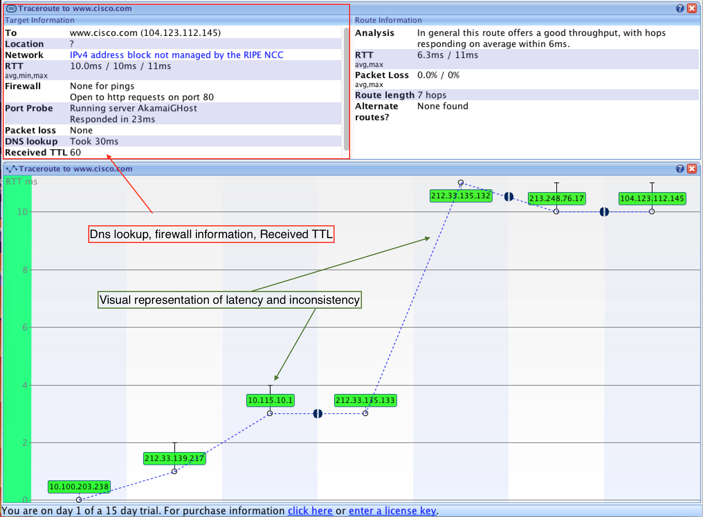

# Compare Paths
Comparing paths when using three different tools 
 
1. traceroute www.cisco.com in the terminal
2. traceroute www.cisco.com on a [web traceroute tool](http://www.subnetonline.com/pages/network-tools/online-tracepath.php)
3. traceroute www.cisco.com using VisualRoute 2010

| hop | Terminal traceroute | Web traceroute | VisualRoute 2010 |
|-----|---------------------|----------------|------------------|
| 1   |212.33.139.217|141.138.203.1|212.33.139.217|
| 2   |10.115.10.1 |80.246.207.190|10.115.10.1|
| 3   |212.33.135.133|80.249.209.208|212.33.135.133|
| 4   |212.33.135.132|23.62.103.197|212.33.135.132|
| 5   |213.248.76.17|                |213.248.76.17|
| 6   |104.123.112.145|                |104.123.11.145|

**Did all the traceroute utilities use the same route?**
 
Terminal traceroute and VisualRoute used the same route, but the web traceroute
utility used a different route. This is logical because the web base traceroute
was exectuted from a webserver and not locally on the pc giving it a different 
starting point with a different IP adress compared to the two other utilities.

**What insights did the VisualRoute utility provide that the two other tools did not?**
 
From the picture below we can se that the VisualRoute tool did provide us with 
a more visual representation of the traceroute. VisualRoute did also provide
some insights about peering points(Where two networks meet). This information
was not obtained from the traceroute Terminal and web utilities.
 

