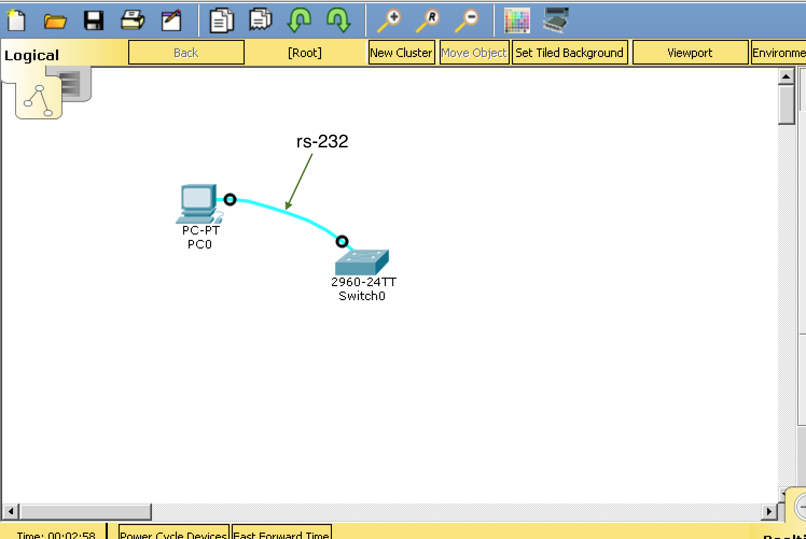
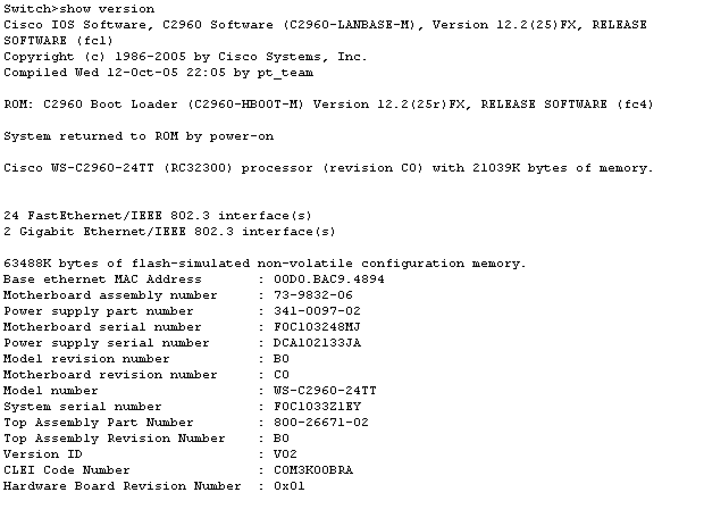
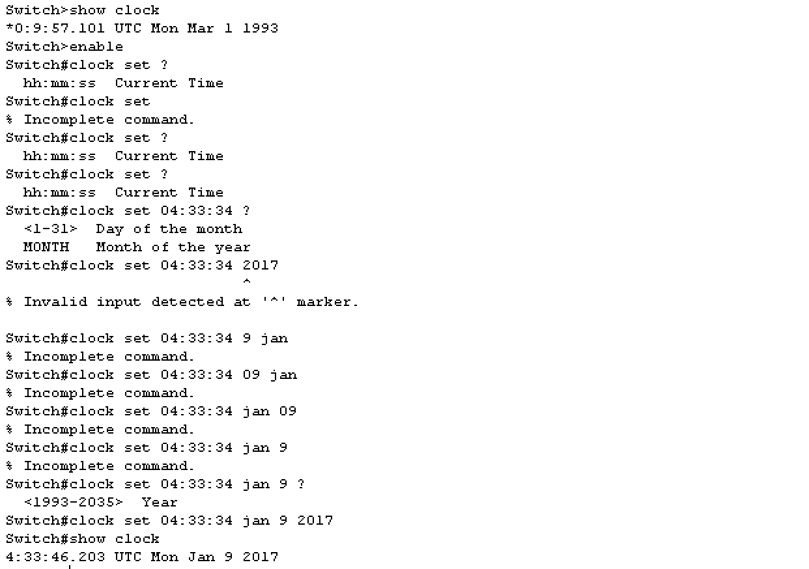

# Access a Cisco switch through the serial console port
The object of this lab is to display the settings and configure the clock. 
 

### Part 1: Access a cisco switch through the serial console port
#### Connect a cisco switch using serial console cable.
#### Establish a console session using a terminal emulator.

### Part 2: Display and configure basic device settings
#### User show commands to display device settings.
 
 

#### Configure the clock on the switch.
 

