# Building a simple network
## Part 1:Set up the network technology(Ethernet only) 
- **Identify calbles and ports for use in the network.**
- **Cable a physical lab topology.**

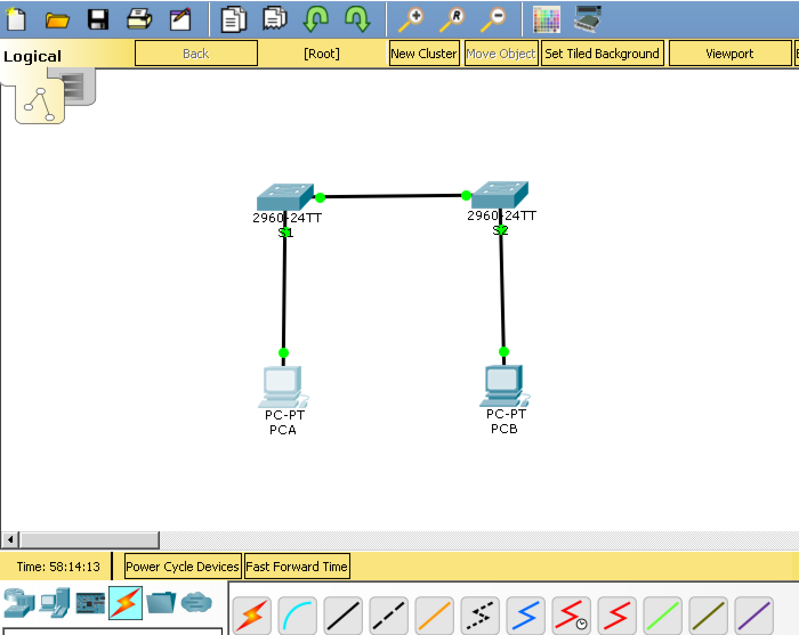

## Part 2:Configure PC Hosts 
- **Enter static IP adress information on the LAN interface of the hosts.**
- **Verify that PCs can communicate using the ping utility.**

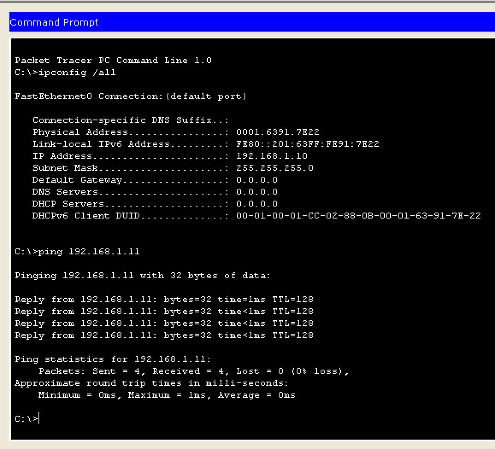

## Part 3: Configure and verify basic switch settings
- **Configure each switch with host names, local password and login banner.**
    - S1 is connected to PCA trought the console port on the switch and
    the serial port on PCA. The image below shows the terminal
    on PCA(Simulation of terra term in cisco packet tracer).
 

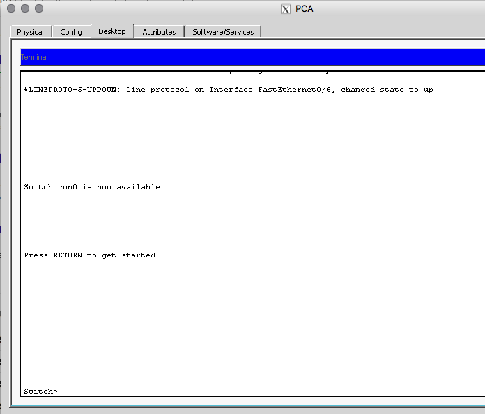

- **Save the running configuration.**
    - Use the **copy** command to save device configuration.
- **Display the running configuration.**
    - Use the **show** command to display the running configuration.
- **Display the IOS(Internetwork Operating System) version for the running switch.**
    - Use the **show** command to display the IOS version.
- **Display the status of the interfaces.**
    - Use the **show** command to display the interface status.  

Below is an example of how to setup the switch with, hostname, password, login banner etc.
> switch> enable
 
> switch# 
 
> switch# **configure terminal** 
 
> switch# **hostname S1**
 
> switch# **no ip domain-lookup**
 
> switch# **enable secret class**    (The password is set to class in order to enable exec mode)
 
> switch# **line con 0**
 
> switch# **password cisco** ( The password to enter the switch terminal is set to cisco)
 
> switch# **login**
 
> switch# **exit**
 
> switch# **banner motd #**
 
Enter text message. Terminate with #
 
> switch# **Unautorized access is strictly prohibited to the full extent of the law. #** 
 
> switch# **exit**
 
> switch# **copy running-config startup-config**
 
> switch# **show running-config**
 
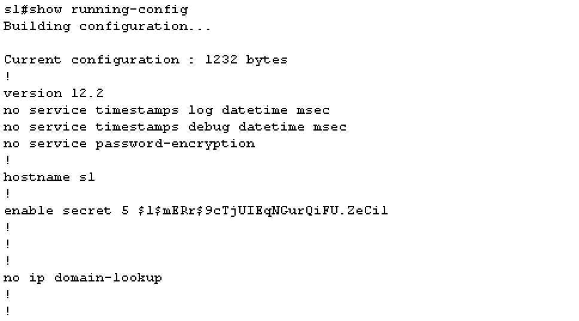
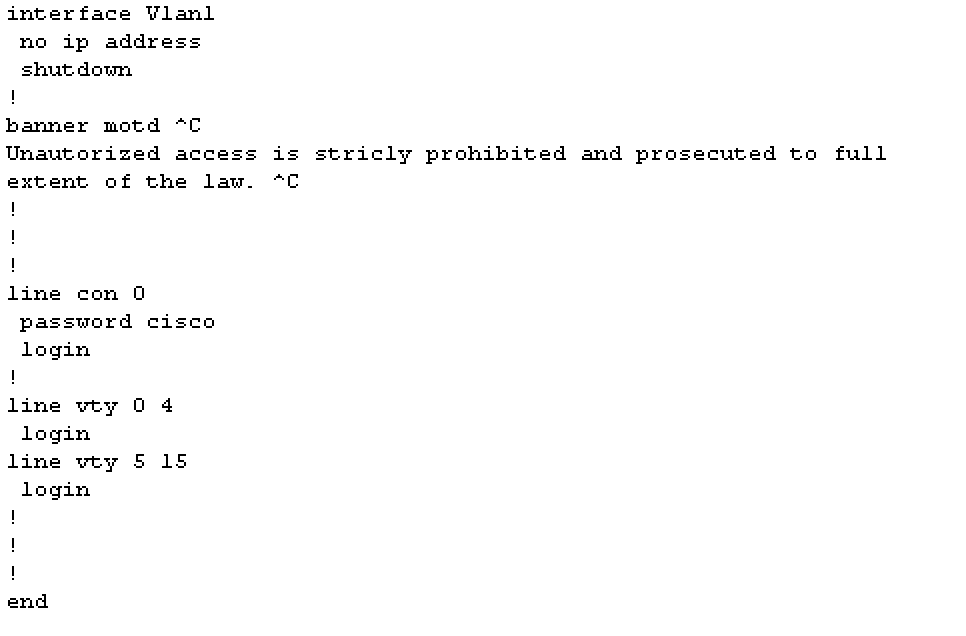

> switch# **show version**
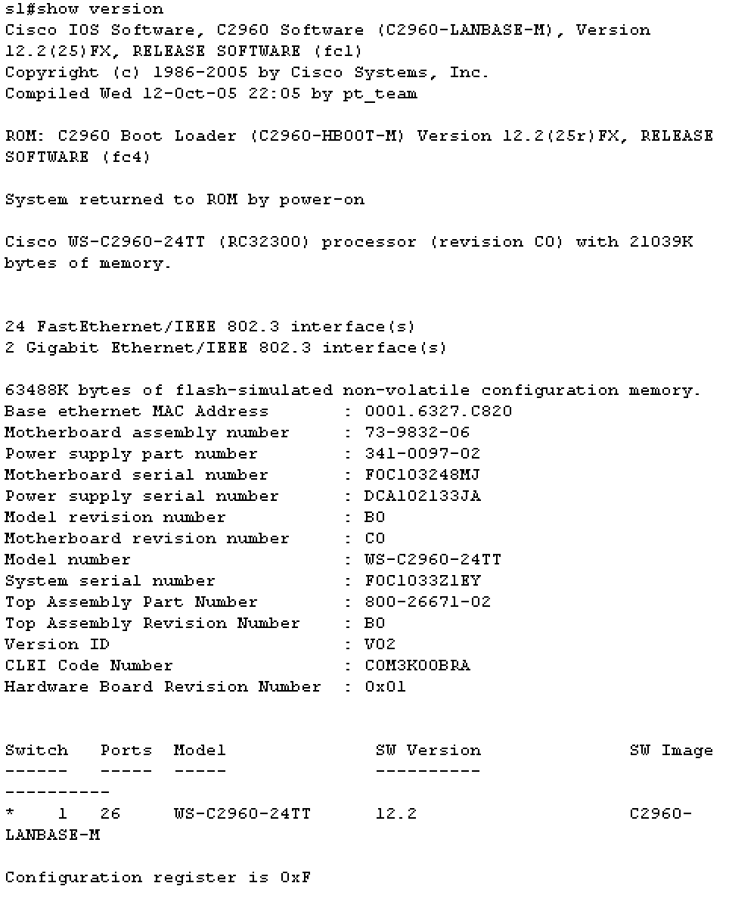
 

> switch# **show ip interface brief**

 

> switch# **show flash**
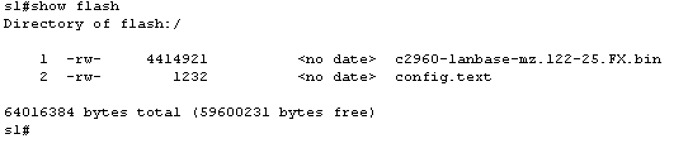
 

> There was no vlan file on this virtual switch so I could not delete it.
 
> switch# **delete vlan.dat**
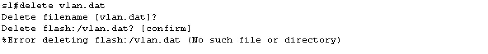
 

> switch# **erase startup-config**
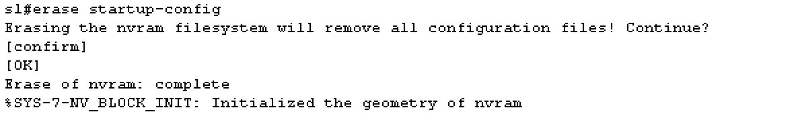
 
> switch# **reload** (This command reloads the switch)
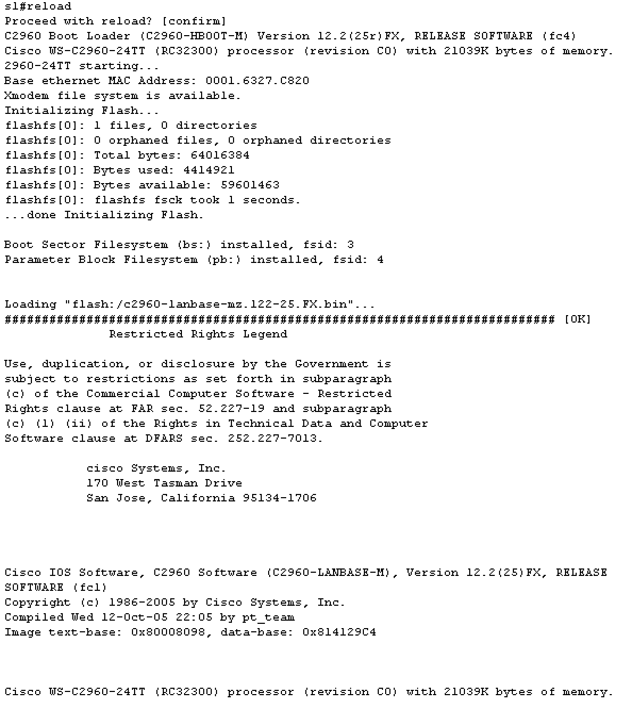
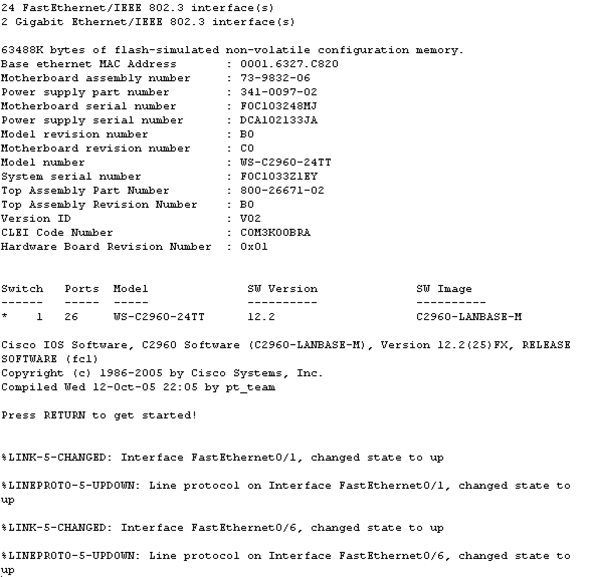

- **Did not receive the promp(would you like to enter the initial configuration...)
 when the switch was reloaded**.

