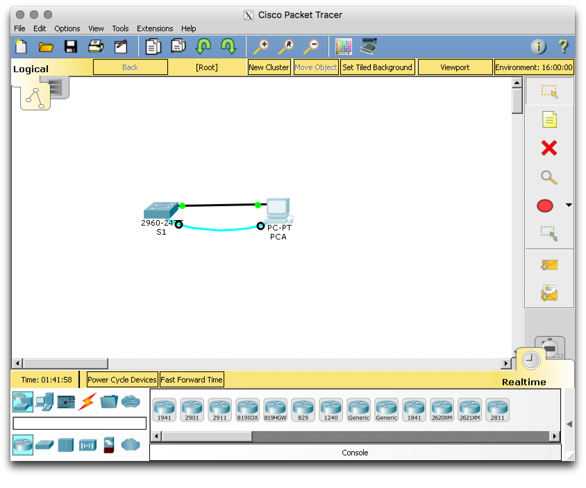
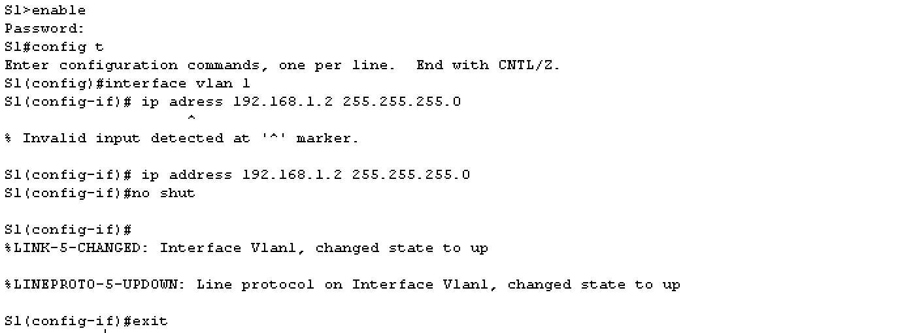
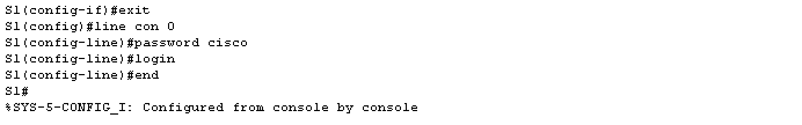
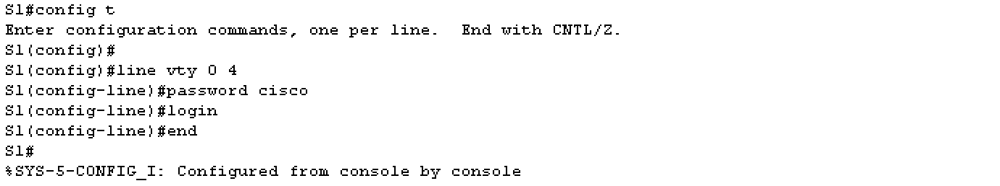
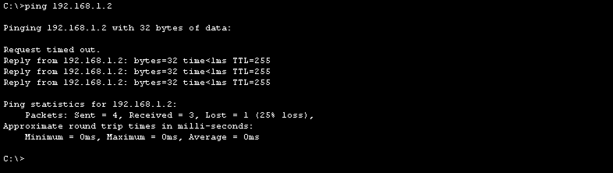
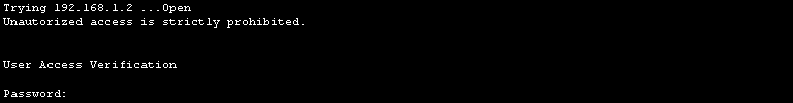
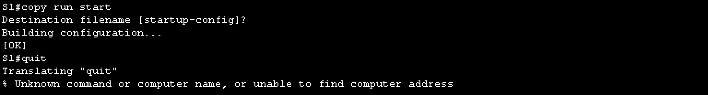

# Configurating a switch management address
### Part 1: Configure a basic network device
#### Cable the network as shown in the topology

#### Configure basic switch settings including host name, management address and Telnet access

> Image below show the configuration of the SVI (Switch virtual Interface)

  
Image below show the setup of password for restricted access on the swtich console.

 
The image below shows the steps in order to configure the virtual terminal(VTY) line for 
the switch to allow Telnet access. (If you do not configure a VTY password
, you will not be able to Telnet to the switch.)

 
#### Configure an IP adress on the PC

### Part 2: Verify and test network connectivity
#### Display device configuration

> S1 # **show run**  
.....................  
> S1 # **show ip interface brief**

#### Test end-to-end connectivity with ping
> Testing end-to-end connection with the ping command in the cmd prompt 

 

#### Test remote capability with Telnet.
> Example of how to issue a telnet command from the cmd prompt.
> 

#### Save the switch running confguration file
> Example of how to save the config file in a telnet session.
> 

# Q&A
<blockquote style="background-color:yellow">
What is the purpose of this command: 
S1(config)# **line con 0**
</blockquote>

<blockquote style="background-color:yellow">

The quit command did not work in the cmd prompt during the telnet session.

</blockquote>
 