# Trace a route to a remote server using tracer(traceroute MacOs terminal)
Hver linje som blir returnert representerer et hopp fra en router til en annen.
En Router er en liten datamskin designet for å dirigere trafikk på internet. 
Når vi bruker traceroute på et domene så får vi returnert hele ruten fra vår pc
til den serveren som dette domenet peker på. Dette blir på en måte en veibeskrivelse 
til denne serveren fra hvor vi er nå. 

Eksempel på Traceroute kall til www.cisco.com i terminalen:
>~$ traceroute www.cisco.com   
traceroute to e144.dscb.akamaiedge.net (23.5.49.120), 64 hops max, 52 byte packets
 >1.  10.0.1.1 (10.0.1.1)  1.601 ms  1.208 ms  1.107 ms
 >2.  10.243.0.1 (10.243.0.1)  7.033 ms  8.402 ms  7.858 ms
 >3.  cm-84.208.41.70.getinternet.no (84.208.41.70)  15.675 ms  10.222 ms  15.760 ms
 >4.  a23-5-48-1.deploy.static.akamaitechnologies.com (23.5.48.1)  15.918 ms  14.903 ms  15.858 ms
 >5.  a23-5-49-120.deploy.static.akamaitechnologies.com (23.5.49.120)  17.009 ms  16.544 ms  15.710 ms
 
Every router has it's own IP adress. The traceroute tool shows the route a package has to travel before it reaches
it's final destination. Three packages are sent and these are used to measure min, max and average latency for each
hop(This means that three packages are sent for every single hop) of the way until our final destination which is the www.cisco.com server in our example above. 
The hop 2(point number 2) is the ISP's POP (Point Of Presence) router. Every ISP has several POP routers that
are located at the end of their network, and this is where the customers connect to the Internet. We can see
from the terminal that the packet travels on the getinternet ISP on the 3 hop and jumps to static.akamaitechnologies
on the 4 hop. This is a critical travel in the trace bacause sometimes there is packet loss in the transition 
between two IPS's or one of the IPS's are slower than the other. 

The formate of each line is as follows: 
>Hop RTT1 RTT2 RTT3 Domain Name [IP Adress] 
>- RTT1, RTT2 and RTT3 is the roundtrip it takes for a package to get to a hop and back to your computer 
(in milliseconds). The travel is inconsistent if the three package latency numbers vary alot.  

_________
**whois** can be used to determine what ISP is on a particular domain. 

>~$ whois 23.5.48.1 
[Akamai International, BV AIBV (NET-23-5-48-0-1) 23.5.48.0 - 23.5.63.255](https://whois.arin.net/rest/nets;q=23.5.48.1?showDetails=true&showARIN=false&showNonArinTopLevelNet=false&ext=netref2)
#
## Examine the traceroute for www.afrinic.net
> ~ $ traceroute www.afrinic.net
traceroute to www.afrinic.net (196.216.2.6), 64 hops max, 52 byte packets
 >1.  10.0.1.1 (10.0.1.1)  1.670 ms  1.214 ms  1.125 ms
 >2.  10.243.0.1 (10.243.0.1)  6.146 ms  7.729 ms  8.105 ms
 >3.  cm-84.208.41.68.getinternet.no (84.208.41.68)  10.443 ms  8.485 ms  7.748 ms
 >4.  ae10-0.poh-pe1.stv.no.ip.tdc.net (93.124.128.162)  7.918 ms  8.790 ms  14.361 ms
 >5.  ae0-0.san-peer2.osl.no.ip.tdc.net (85.19.120.129)  15.542 ms  16.581 ms  14.491 ms
 >6.  4.68.72.25 (4.68.72.25)  15.695 ms  15.342 ms  15.536 ms
 >7.  ae-228-3604.edge3.london1.level3.net (4.69.166.158)  38.191 ms  51.901 ms
    ae-226-3602.edge3.london1.level3.net (4.69.166.150)  37.870 ms
 >8.  internet-so.edge3.london1.level3.net (195.50.124.34)  41.399 ms  40.679 ms  40.724 ms
 >9.  168.209.0.177 (168.209.0.177)  225.873 ms  234.537 ms  310.096 ms
>10.  168.209.0.177 (168.209.0.177)  304.353 ms  306.709 ms  307.168 ms
>11.  196.26.0.68 (196.26.0.68)  205.613 ms  205.424 ms  203.128 ms
>12.  196.37.155.172 (196.37.155.172)  235.932 ms  307.010 ms  307.039 ms
>13.  196.216.3.131 (196.216.3.131)  307.189 ms  258.175 ms  307.593 ms
>14.  www.afrinic.net (196.216.2.6)  306.994 ms  273.710 ms  307.201 ms

**What happens at hop 7?** 
It looks like the travel time is inconsistent. The RTT2 package uses more time than the other two.
One of the packages is actually sendt to a different IP adress  

# Qustions from the introduction to networking book 1.3.1.3 Part 2
**What happens at hop 7?** 
All three packages are received at the exact same time. 

# Trace a route to a remote server using web-based and software tools.
## Step 1 Use web-based [traceroute tool](http://www.subnetonline.com/pages/network-tools/online-tracepath.php)
Se lab boka for svar på spørsmål og trykk på teksten under for
 referanse på asymm spørsmål.
  
[The path the package takes is dependent on the router balansing
in between the different ip adresses throughout the path where
the package travels](http://www.bgpbook.com/archpolicyasymmetry.html)
 
## Step 2 Use VisualRoute Lite Edition
[download visual route lite](http://www.visualroute.com/download.html)
 

# Compare Paths
Comparing paths when using three different tools 
 
1. traceroute www.cisco.com in the terminal
2. traceroute www.cisco.com on a [web traceroute tool](http://www.subnetonline.com/pages/network-tools/online-tracepath.php)
3. traceroute www.cisco.com using VisualRoute 2010

| hop | Terminal traceroute | Web traceroute | VisualRoute 2010 |
|-----|---------------------|----------------|------------------|
| 1   |212.33.139.217|141.138.203.1|212.33.139.217|
| 2   |10.115.10.1 |80.246.207.190|10.115.10.1|
| 3   |212.33.135.133|80.249.209.208|212.33.135.133|
| 4   |212.33.135.132|23.62.103.197|212.33.135.132|
| 5   |213.248.76.17|                |213.248.76.17|
| 6   |104.123.112.145|                |104.123.11.145|

**Did all the traceroute utilities use the same route?**
 
Terminal traceroute and VisualRoute used the same route, but the web traceroute
utility used a different route. This is logical because the web base traceroute
was exectuted from a webserver and not locally on the pc giving it a different 
starting point with a different IP adress compared to the two other utilities.

**What insights did the VisualRoute utility provide that the two other tools did not?**
 
From the picture below we can se that the VisualRoute tool did provide us with 
a more visual representation of the traceroute. VisualRoute did also provide
some insights about peering points(Where two networks meet). This information
was not obtained from the traceroute Terminal and web utilities.
 
<a href="VisualRoute-www.cisco.com.png
" target="_blank">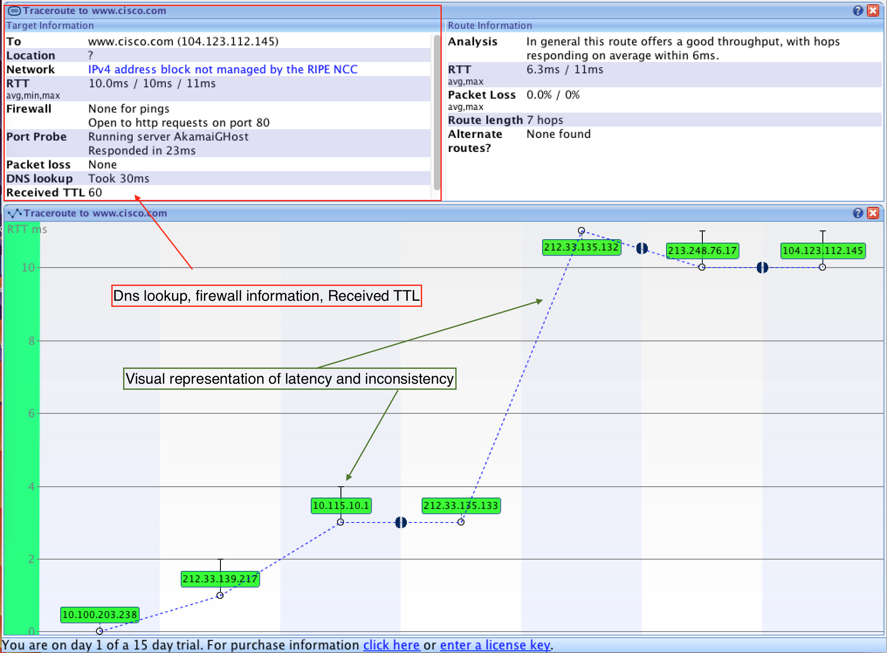</a>

# Trace a route to a remote server using tracer(traceroute MacOs terminal)
Hver linje som blir returnert representerer et hopp fra en router til en annen.
En Router er en liten datamskin designet for å dirigere trafikk på internet. 
Når vi bruker traceroute på et domene så får vi returnert hele ruten fra vår pc
til den serveren som dette domenet peker på. Dette blir på en måte en veibeskrivelse 
til denne serveren fra hvor vi er nå. 

Eksempel på Traceroute kall til www.cisco.com i terminalen:
>~$ traceroute www.cisco.com   
traceroute to e144.dscb.akamaiedge.net (23.5.49.120), 64 hops max, 52 byte packets
 >1.  10.0.1.1 (10.0.1.1)  1.601 ms  1.208 ms  1.107 ms
 >2.  10.243.0.1 (10.243.0.1)  7.033 ms  8.402 ms  7.858 ms
 >3.  cm-84.208.41.70.getinternet.no (84.208.41.70)  15.675 ms  10.222 ms  15.760 ms
 >4.  a23-5-48-1.deploy.static.akamaitechnologies.com (23.5.48.1)  15.918 ms  14.903 ms  15.858 ms
 >5.  a23-5-49-120.deploy.static.akamaitechnologies.com (23.5.49.120)  17.009 ms  16.544 ms  15.710 ms
 
Every router has it's own IP adress. The traceroute tool shows the route a package has to travel before it reaches
it's final destination. Three packages are sent and these are used to measure min, max and average latency for each
hop(This means that three packages are sent for every single hop) of the way until our final destination which is the www.cisco.com server in our example above. 
The hop 2(point number 2) is the ISP's POP (Point Of Presence) router. Every ISP has several POP routers that
are located at the end of their network, and this is where the customers connect to the Internet. We can see
from the terminal that the packet travels on the getinternet ISP on the 3 hop and jumps to static.akamaitechnologies
on the 4 hop. This is a critical travel in the trace bacause sometimes there is packet loss in the transition 
between two IPS's or one of the IPS's are slower than the other. 

The formate of each line is as follows: 
>Hop RTT1 RTT2 RTT3 Domain Name [IP Adress] 
>- RTT1, RTT2 and RTT3 is the roundtrip it takes for a package to get to a hop and back to your computer 
(in milliseconds). The travel is inconsistent if the three package latency numbers vary alot.  

_________
**whois** can be used to determine what ISP is on a particular domain. 

>~$ whois 23.5.48.1 
[Akamai International, BV AIBV (NET-23-5-48-0-1) 23.5.48.0 - 23.5.63.255](https://whois.arin.net/rest/nets;q=23.5.48.1?showDetails=true&showARIN=false&showNonArinTopLevelNet=false&ext=netref2)
#
## Examine the traceroute for www.afrinic.net
> ~ $ traceroute www.afrinic.net
traceroute to www.afrinic.net (196.216.2.6), 64 hops max, 52 byte packets
 >1.  10.0.1.1 (10.0.1.1)  1.670 ms  1.214 ms  1.125 ms
 >2.  10.243.0.1 (10.243.0.1)  6.146 ms  7.729 ms  8.105 ms
 >3.  cm-84.208.41.68.getinternet.no (84.208.41.68)  10.443 ms  8.485 ms  7.748 ms
 >4.  ae10-0.poh-pe1.stv.no.ip.tdc.net (93.124.128.162)  7.918 ms  8.790 ms  14.361 ms
 >5.  ae0-0.san-peer2.osl.no.ip.tdc.net (85.19.120.129)  15.542 ms  16.581 ms  14.491 ms
 >6.  4.68.72.25 (4.68.72.25)  15.695 ms  15.342 ms  15.536 ms
 >7.  ae-228-3604.edge3.london1.level3.net (4.69.166.158)  38.191 ms  51.901 ms
    ae-226-3602.edge3.london1.level3.net (4.69.166.150)  37.870 ms
 >8.  internet-so.edge3.london1.level3.net (195.50.124.34)  41.399 ms  40.679 ms  40.724 ms
 >9.  168.209.0.177 (168.209.0.177)  225.873 ms  234.537 ms  310.096 ms
>10.  168.209.0.177 (168.209.0.177)  304.353 ms  306.709 ms  307.168 ms
>11.  196.26.0.68 (196.26.0.68)  205.613 ms  205.424 ms  203.128 ms
>12.  196.37.155.172 (196.37.155.172)  235.932 ms  307.010 ms  307.039 ms
>13.  196.216.3.131 (196.216.3.131)  307.189 ms  258.175 ms  307.593 ms
>14.  www.afrinic.net (196.216.2.6)  306.994 ms  273.710 ms  307.201 ms

**What happens at hop 7?** 
It looks like the travel time is inconsistent. The RTT2 package uses more time than the other two.
One of the packages is actually sendt to a different IP adress  

# Qustions from the introduction to networking book 1.3.1.3 Part 2
**What happens at hop 7?** 
All three packages are received at the exact same time. 

# Trace a route to a remote server using web-based and software tools.
## Step 1 Use web-based [traceroute tool](http://www.subnetonline.com/pages/network-tools/online-tracepath.php)
Se lab boka for svar på spørsmål og trykk på teksten under for
 referanse på asymm spørsmål.
  
[The path the package takes is dependent on the router balansing
in between the different ip adresses throughout the path where
the package travels](http://www.bgpbook.com/archpolicyasymmetry.html)
 
## Step 2 Use VisualRoute Lite Edition
[download visual route lite](http://www.visualroute.com/download.html)
 

# Compare Paths
Comparing paths when using three different tools 
 
1. traceroute www.cisco.com in the terminal
2. traceroute www.cisco.com on a [web traceroute tool](http://www.subnetonline.com/pages/network-tools/online-tracepath.php)
3. traceroute www.cisco.com using VisualRoute 2010

| hop | Terminal traceroute | Web traceroute | VisualRoute 2010 |
|-----|---------------------|----------------|------------------|
| 1   |212.33.139.217|141.138.203.1|212.33.139.217|
| 2   |10.115.10.1 |80.246.207.190|10.115.10.1|
| 3   |212.33.135.133|80.249.209.208|212.33.135.133|
| 4   |212.33.135.132|23.62.103.197|212.33.135.132|
| 5   |213.248.76.17|                |213.248.76.17|
| 6   |104.123.112.145|                |104.123.11.145|

**Did all the traceroute utilities use the same route?**
 
Terminal traceroute and VisualRoute used the same route, but the web traceroute
utility used a different route. This is logical because the web base traceroute
was exectuted from a webserver and not locally on the pc giving it a different 
starting point with a different IP adress compared to the two other utilities.

**What insights did the VisualRoute utility provide that the two other tools did not?**
 
From the picture below we can se that the VisualRoute tool did provide us with 
a more visual representation of the traceroute. VisualRoute did also provide
some insights about peering points(Where two networks meet). This information
was not obtained from the traceroute Terminal and web utilities.
 

# Building a simple network
## Part 1:Set up the network technology(Ethernet only) 
- **Identify calbles and ports for use in the network.**
- **Cable a physical lab topology.**

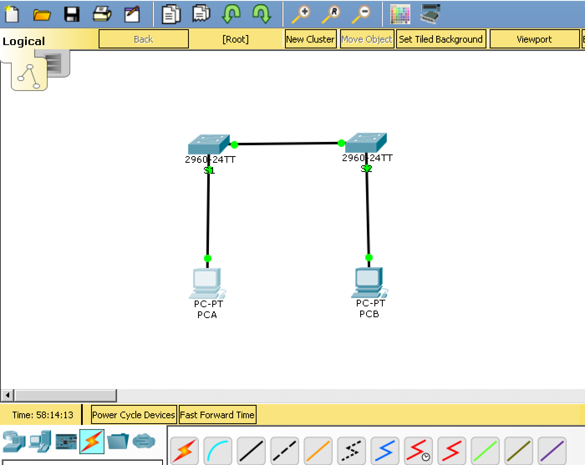

## Part 2:Configure PC Hosts 
- **Enter static IP adress information on the LAN interface of the hosts.**
- **Verify that PCs can communicate using the ping utility.**

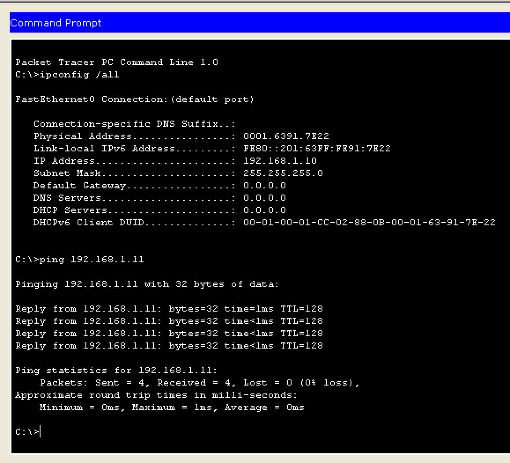

## Part 3: Configure and verify basic switch settings
- **Configure each switch with host names, local password and login banner.**
    - S1 is connected to PCA trought the console port on the switch and
    the serial port on PCA. The image below shows the terminal
    on PCA(Simulation of terra term in cisco packet tracer).
 

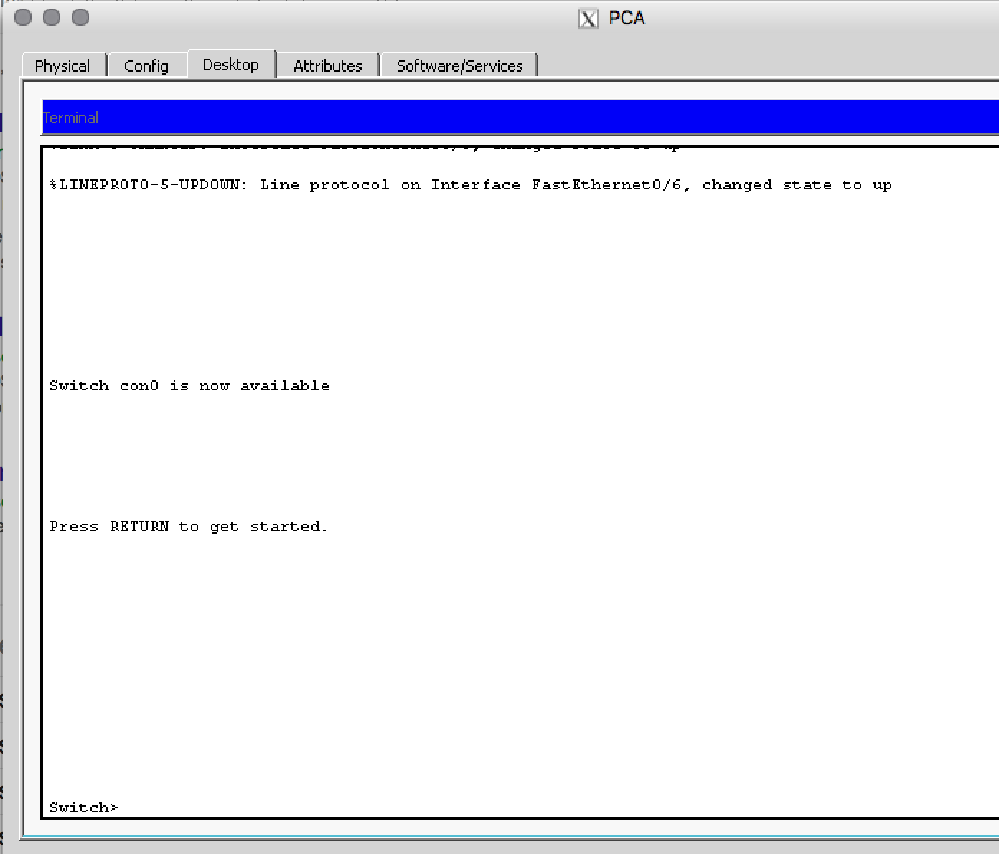

- **Save the running configuration.**
    - Use the **copy** command to save device configuration.
- **Display the running configuration.**
    - Use the **show** command to display the running configuration.
- **Display the IOS(Internetwork Operating System) version for the running switch.**
    - Use the **show** command to display the IOS version.
- **Display the status of the interfaces.**
    - Use the **show** command to display the interface status.  

Below is an example of how to setup the switch with, hostname, password, login banner etc.
> switch> enable
 
> switch# 
 
> switch# **configure terminal** 
 
> switch# **hostname S1**
 
> switch# **no ip domain-lookup**
 
> switch# **enable secret class**    (The password is set to class in order to enable exec mode)
 
> switch# **line con 0**
 
> switch# **password cisco** ( The password to enter the switch terminal is set to cisco)
 
> switch# **login**
 
> switch# **exit**
 
> switch# **banner motd #**
 
Enter text message. Terminate with #
 
> switch# **Unautorized access is strictly prohibited to the full extent of the law. #** 
 
> switch# **exit**
 
> switch# **copy running-config startup-config**
 
> switch# **show running-config**
 
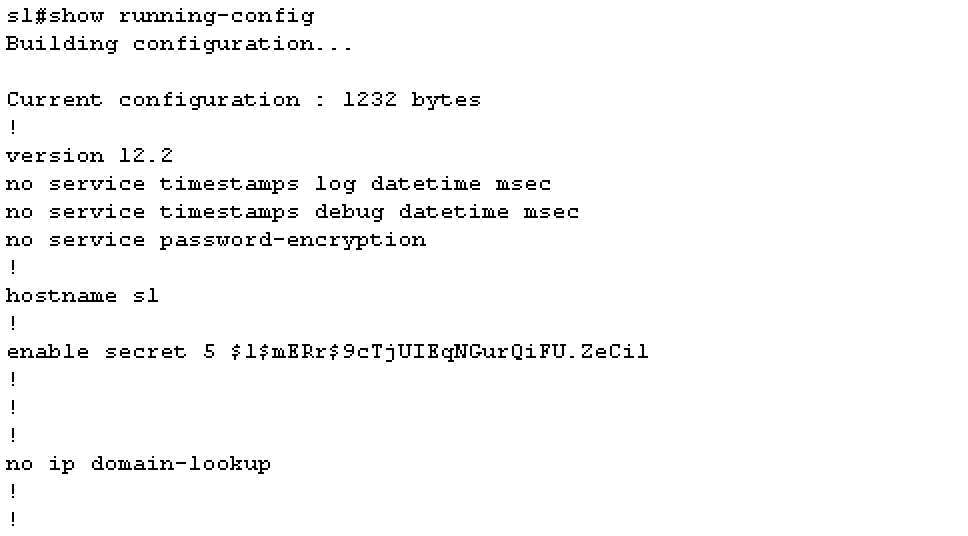
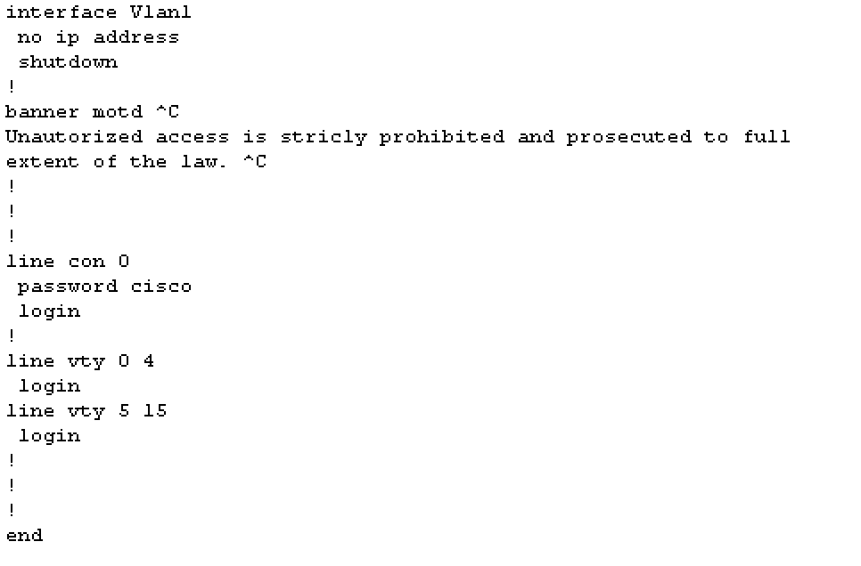

> switch# **show version**
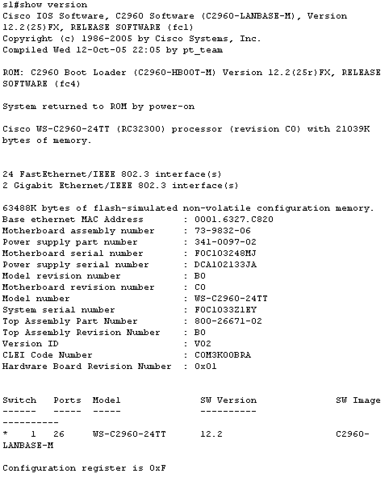
 

> switch# **show ip interface brief**

 

> switch# **show flash**
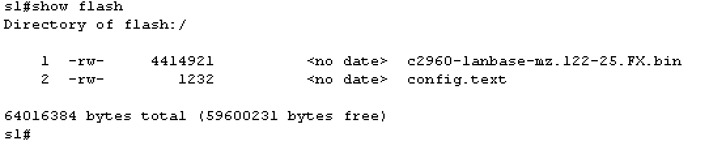
 

> There was no vlan file on this virtual switch so I could not delete it.
 
> switch# **delete vlan.dat**
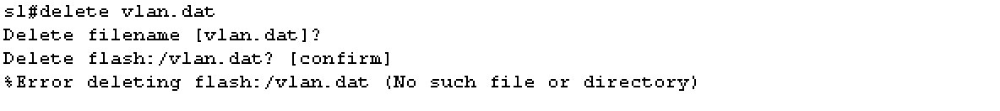
 

> switch# **erase startup-config**
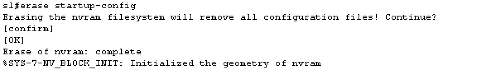
 
> switch# **reload** (This command reloads the switch)
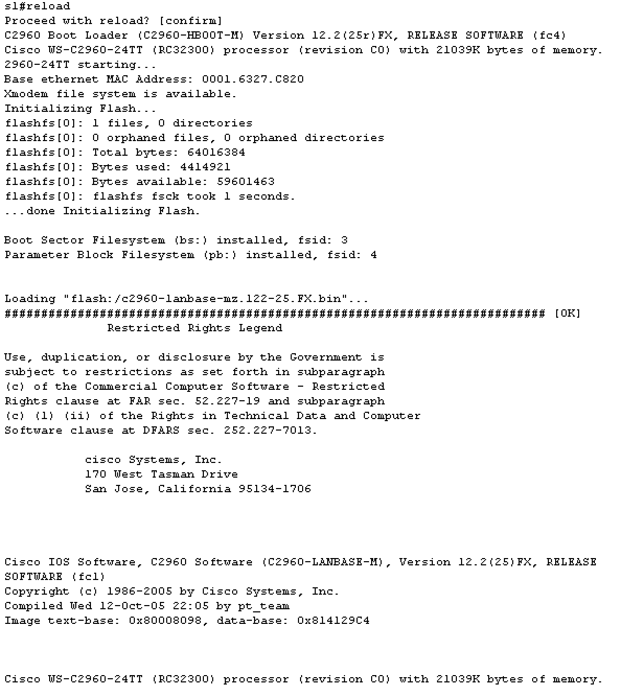
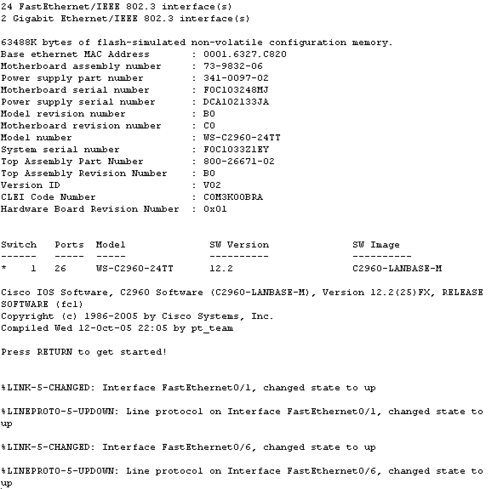

- **Did not receive the promp(would you like to enter the initial configuration...)
 when the switch was reloaded**.

# Configurating a switch management address
### Part 1: Configure a basic network device
#### Cable the network as shown in the topology
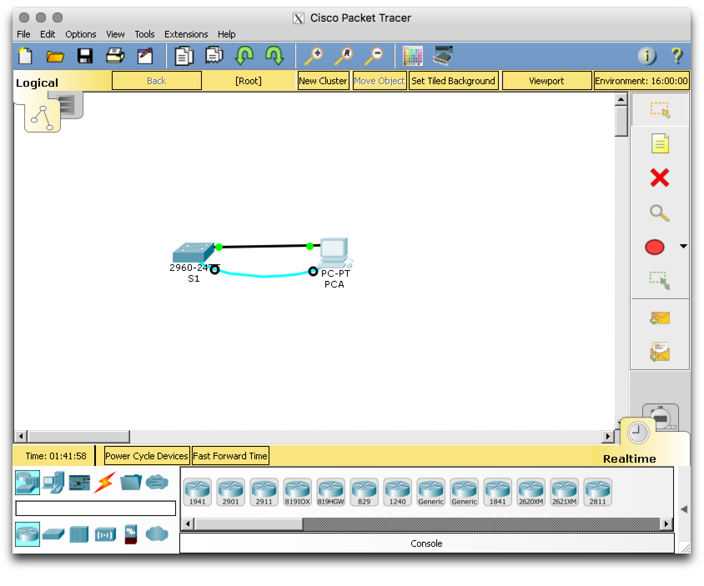

#### Configure basic switch settings including host name, management address and Telnet access

> Image below show the configuration of the SVI (Switch virtual Interface)
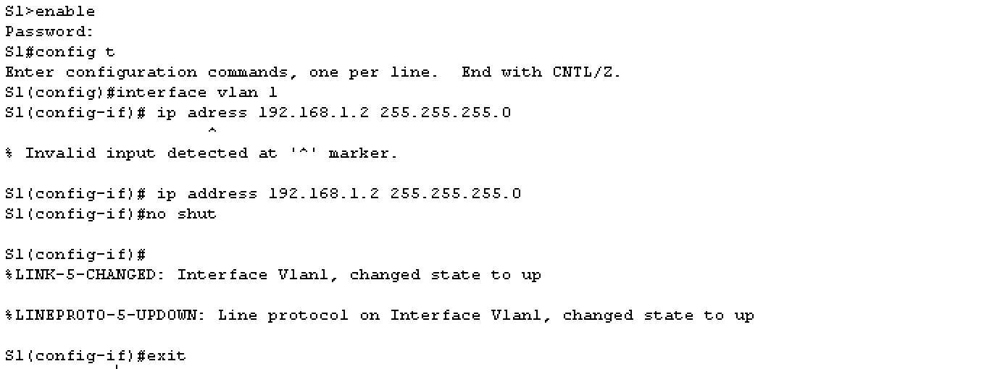
  
Image below show the setup of password for restricted access on the swtich console.
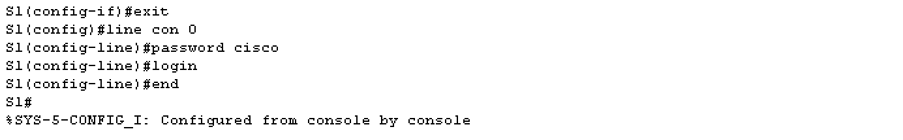
 
The image below shows the steps in order to configure the virtual terminal(VTY) line for 
the switch to allow Telnet access. (If you do not configure a VTY password
, you will not be able to Telnet to the switch.)
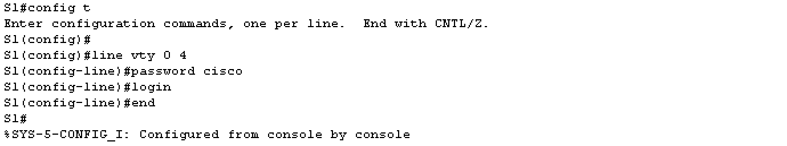
 
#### Configure an IP adress on the PC

### Part 2: Verify and test network connectivity
#### Display device configuration

> S1 # **show run**  
.....................  
> S1 # **show ip interface brief**

#### Test end-to-end connectivity with ping
> Testing end-to-end connection with the ping command in the cmd prompt 
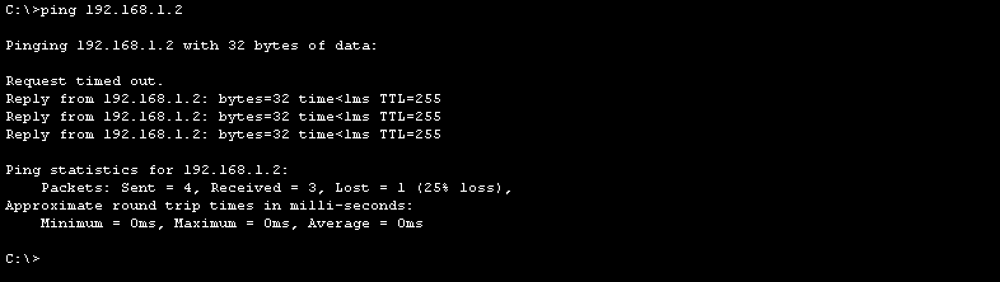
 

#### Test remote capability with Telnet.
> Example of how to issue a telnet command from the cmd prompt.
> 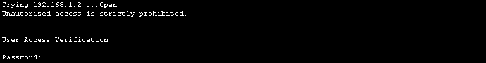

#### Save the switch running confguration file
> Example of how to save the config file in a telnet session.
> 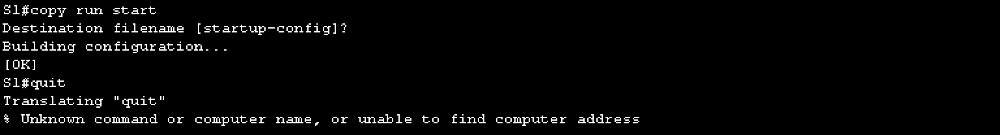

# Q&A
<blockquote style="background-color:yellow">
What is the purpose of this command: 
S1(config)# **line con 0**
</blockquote>

<blockquote style="background-color:yellow">

The quit command did not work in the cmd prompt during the telnet session.

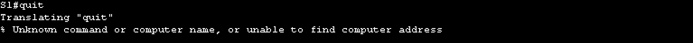
</blockquote>
 